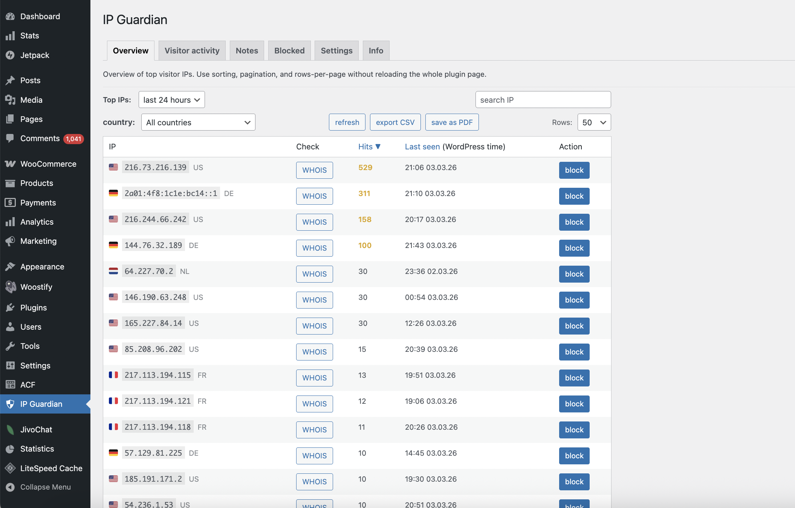
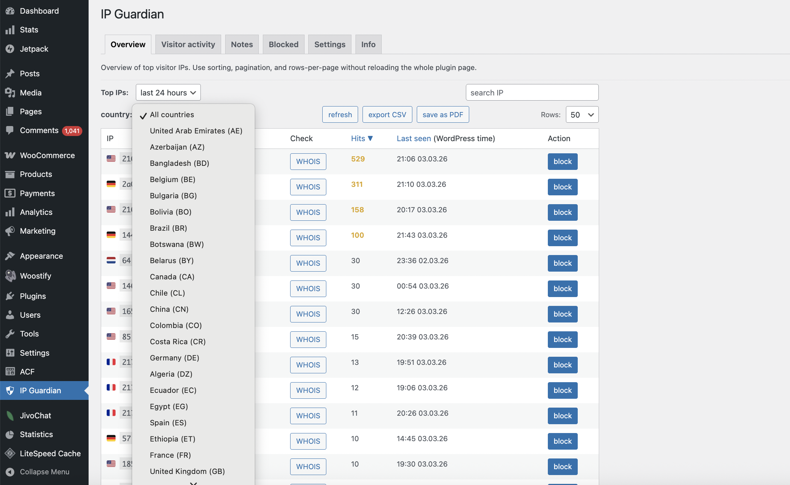
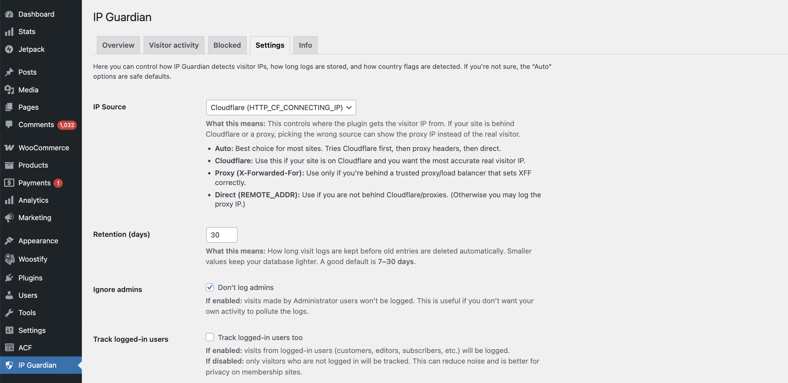

# DIA IP Guardian

**DIA IP Guardian** is a minimal, developer-friendly WordPress plugin that logs visitor IP activity and lets you block suspicious traffic — without external analytics, SaaS dashboards, or bloated security suites.

Built for devs and site owners who want **simple, local visibility** right inside wp-admin.

---

## ✨ Features

- ✅ Logs visitor **IP + time + URL + user agent**
- ✅ **Top IPs** tables: last **24 hours / 3 days / 7 days**
- ✅ **Recent visitor activity** table (full URL + browser info)
- ✅ One-click **Block / Unblock**
- ✅ Works behind **Cloudflare** and **proxies**
- ✅ Optional **country detection + flags**
  - Cloudflare header (fast)
  - MaxMind mmdb (local + private)
  - Remote vendor fallback (admin-only, cached)
- ✅ **Country dropdown filter** (shows only countries you actually got hits from)
- ✅ AJAX sorting / pagination / rows-per-page **without reloading the whole page**
- ✅ Automatic log cleanup (configurable retention)
- ✅ No frontend scripts, no trackers

---

## 🎯 Why this plugin exists

Most analytics plugins focus on marketing and hide raw IP-level visibility.

DIA IP Guardian focuses on infrastructure visibility:

- Identify suspicious crawlers & scrapers
- Detect spam traffic patterns
- Monitor unusual spikes
- Quickly block abusive IPs

All directly from the WordPress dashboard.

---

## ⚡ Lightweight by design

- No external analytics
- No SaaS dependencies
- Minimal database footprint (dedicated table + indexes)
- No frontend JS/CSS
- Runs only inside WordPress

---

## 🧭 Geo / Country Flags (optional)

Country flags are shown in admin tables when country can be resolved.

Supported modes:

- **Auto** (recommended): Cloudflare → MaxMind → Remote (if enabled)
- **Cloudflare only**: uses `HTTP_CF_IPCOUNTRY` (works only for current requests)
- **MaxMind**: local GeoLite2 mmdb (fast + private, needs setup)
- **Remote API (admin-only)**: optional fallback, cached to reduce calls
- **Off**: disables country lookup

> Remote geo lookups are **admin-only** to avoid slowing down visitors.

---

## 🔧 Configuration

Inside **IP Guardian → Settings**:

### IP Source
- Auto (CF → XFF → REMOTE_ADDR)
- Cloudflare (`HTTP_CF_CONNECTING_IP`)
- Proxy (`X-Forwarded-For`)
- Direct (`REMOTE_ADDR`)

### Retention
- Configure how many days logs are kept (auto cleanup).

### Geo Detection
- Auto / Off / Cloudflare-only / MaxMind / Remote API
- Enable/disable remote lookups + choose vendor
- Optional MaxMind mmdb file path

---

## 🛠 Use cases

- Developers debugging suspicious traffic
- WooCommerce stores monitoring bots and scraping
- Sites behind Cloudflare needing real IP visibility
- Minimal security setups without heavy plugins

---

## 🧠 Technical notes

- Logs are stored locally in a dedicated table:
  - `ip`, `country`, `url`, `user_agent`, `created_at`
  - Indexed for fast queries (IP+date, country+date, etc.)
- Cleanup runs via WP Cron (and can be triggered manually in Settings)
- Admin tables support AJAX pagination/sorting

---

## 🔒 Privacy note

IP addresses may be considered personal data in some regions (e.g., GDPR).

If you use this plugin in production, mention IP logging in your Privacy Policy:
- what is collected (IP, URL, user agent, time)
- why (security, abuse prevention)
- how long it’s stored (retention days)

You are responsible for compliance with local laws.

---

## 📌 Status

**Early but stable.**  
Built as a small internal tool and shared publicly for developers who want a clean, minimal solution.

---

## 📷 Screenshots

### Overview – Top IPs

### Overview – Country Filter (All Countries)

### Recent Visitor Activity

### Settings Screen

---

## License
GPLv2 or later
